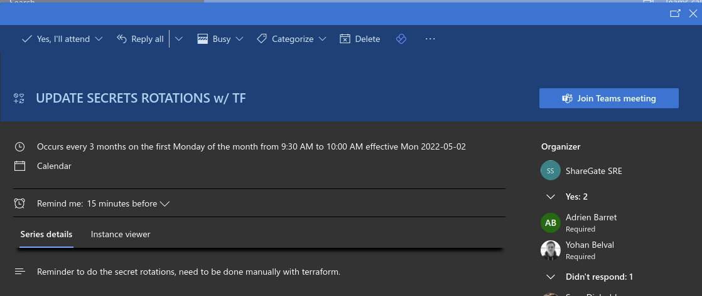
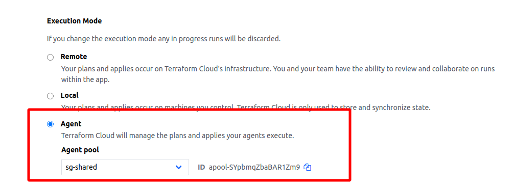

# Gravt Terraform

Infrastructure as code for ShareGate Teams Management, a.k.a. Apricot, codename Gravt.

_**NOTE**: The values for the sensitive variables in Terraform workspaces can be obtained in the shared LastPass folders._

## Login

To login to terraform cloud from your local setup, follow this [documentation](https://developer.hashicorp.com/terraform/tutorials/cloud-get-started/cloud-login).

## Projects

### apricot-app-secret-rotation

Used to rotate Azure AD client secrets stored in Azure Key Vault secrets.

- Secret expiration is 6 months
- Secret rotation is done manually every 3 months, reminded by a calendar event.

For more information, check out [the README.md](./apricot-app-secret-rotation/README.md).

### apricot-shared

Azure infrastructure for shared developer resources.

[workspace](https://app.terraform.io/app/ShareGate/workspaces/apricot-shared)

### sg-gravt

Azure infrastructure necessary for ShareGate Gravt staging and production environments.

- [staging workspace](https://app.terraform.io/app/ShareGate/workspaces/sg-gravt-staging)
- [production workspace](https://app.terraform.io/app/ShareGate/workspaces/sg-gravt-prod)

### sg-on-demand

Azure infrastructure necessary for ShareGate QA and on-demand environments.

[qa workspace](https://app.terraform.io/app/ShareGate/workspaces/sg-on-demand)

### sg-perf-metrics

Azure infrastructure for the development environment around ShareGate performance metrics.

Could make sens to migration to the shared workspace since it's hosted in the _sharegate-shared-dev_ subscription.

For more information, see the _#sg-devops-metrics_ Slack channel.

[workspace](https://app.terraform.io/app/ShareGate/workspaces/sg-perf-metrics)

### sg-shared

Azure infrastructure for shared resources in the ShareGate development landscape. An AKS cluster which hosts the following:

- Hashicorp Vault (used for Mongo Atlas dynamic credentials)
- Ansible AWX (used for configuring EventStoreDb VMs)

[workspace](https://app.terraform.io/app/ShareGate/workspaces/sg-shared)

### sg-shared-prod

Azure infrastructure for shared resources in the ShareGate production landscape. Mainly used to share the wildcard ShareGate certificate through a common Key Vault.

[workspace](https://app.terraform.io/app/ShareGate/workspaces/sg-shared-prod)

### sg-vault

Hashicorp Vault configuration to setup SSO (OIDC), policies and Mongo Atlas secret management engine (dynamic credentials used by developers).

_**NOTE: Since Vault is hosted in a private AKS cluster, the Terraform code needs to be executed in a private Terraform Agent**_

[workspace](https://app.terraform.io/app/ShareGate/workspaces/sg-vault)

## Modules

## sg-eventstore

Azure infrastructure for eventstore. Module used by the sg-gravt project.

[workspace](https://app.terraform.io/app/ShareGate/workspaces/sg-eventstore-prod)
